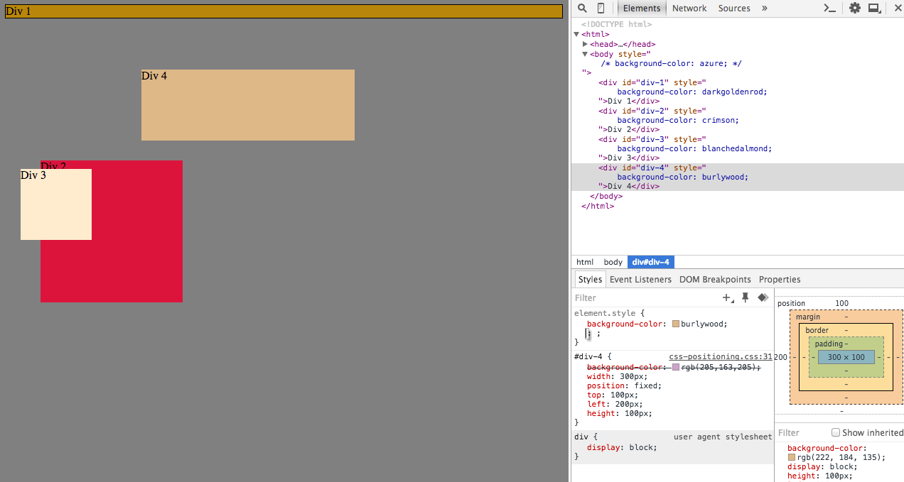
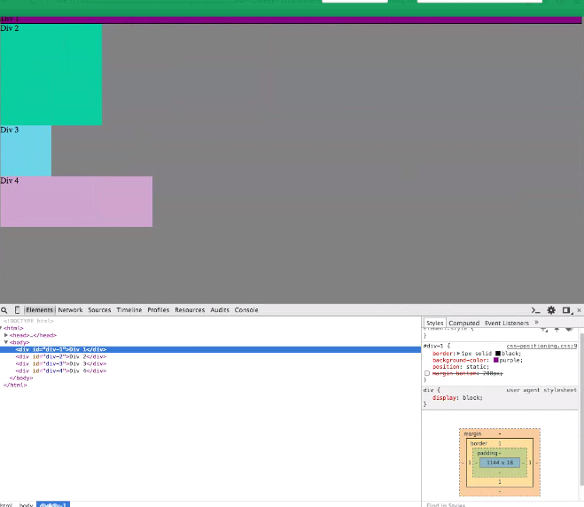
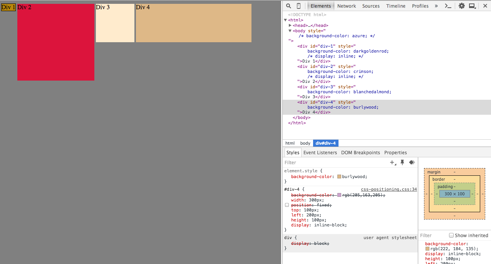
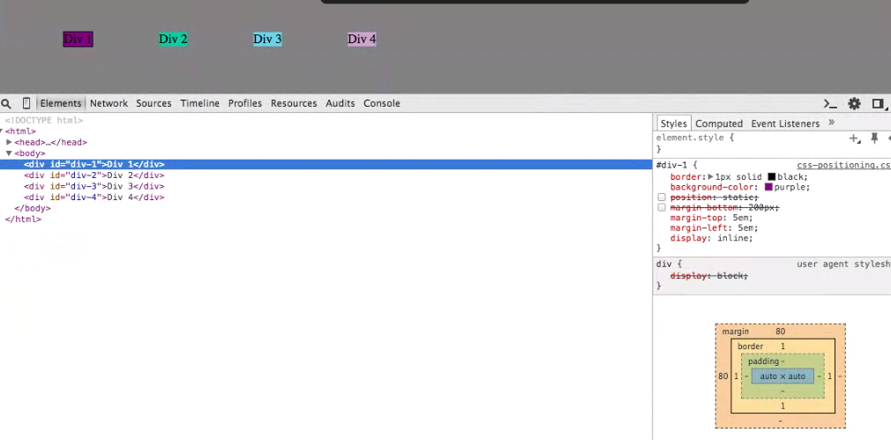
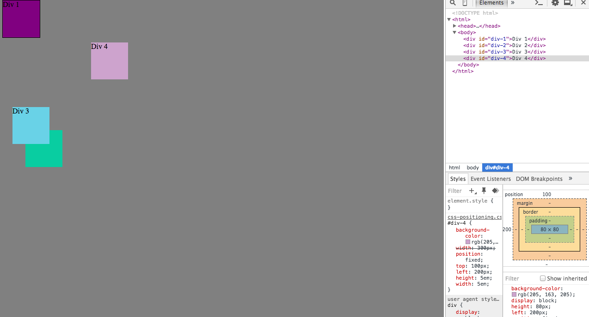
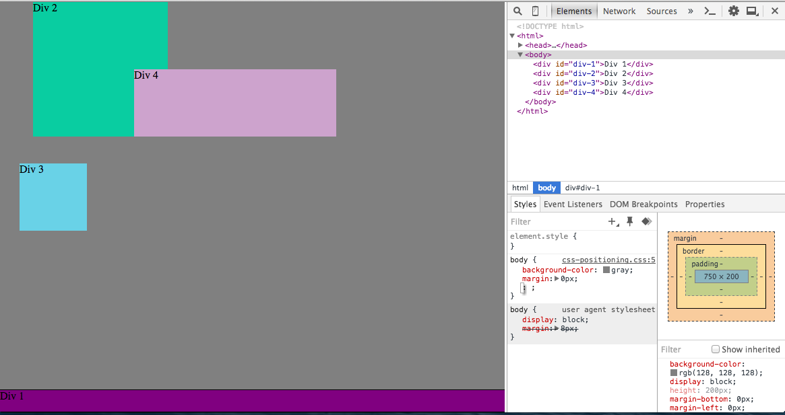
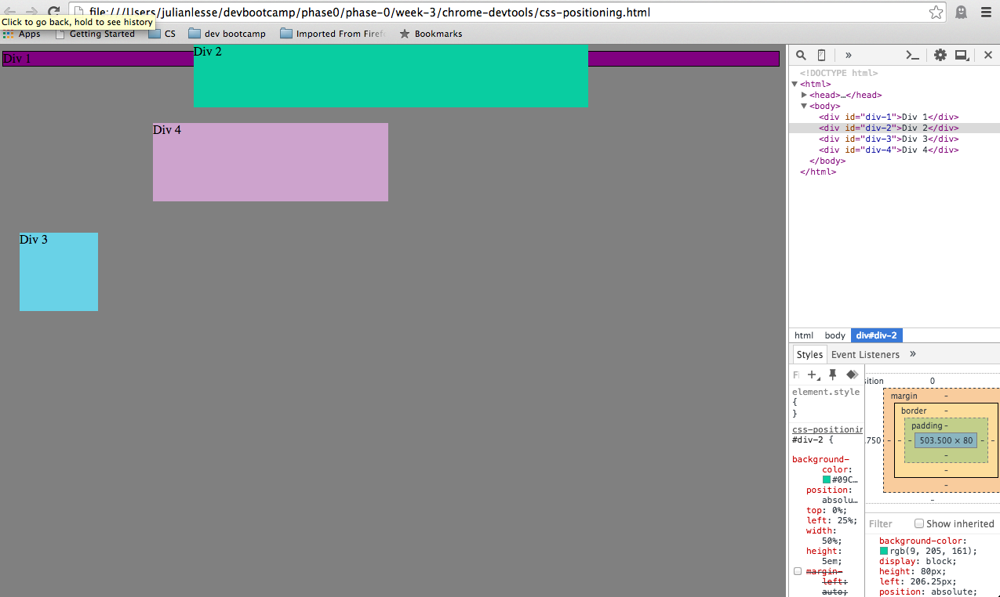

## 1.

## 2.

## 3.

## 4.

## 5.

## 6.

## 7.

## 8.

## 9.

How can you use Chrome's DevTools inspector to help you format or position
elements? How can you resize elements on the DOM using CSS? What are the
differences between Absolute, Fixed, Static, and Relative positioning? Which
did you find easiest to use? Which was most difficult? What are the
differences between Margin, Border, and Padding? What was your impression of
this challenge overall? (love, hate, and why?)

Chrome DevTools are really helpful because they give you a
visualization of the all of the display properties on the page, and a
sand box for rapidly experimenting with them. Its especially good for
positioning because you can make small changes and quickly see the
impact, and judge what changes to make based on the visual properties
of the element boxes on the page.

You can size elements by setting the height and/or width attributes to
a % value. This will resize the element when the parent element is
resized. If the parent element is the body, it should change when the
window size changes. You can also allow the user to resize an element
by setting the resize value of its CSS to both, vertical or
horizontal.

By default, all elements are set to static positioning. An element with static positioning is not affected by the left, right, bottom or top, properties. Static elements positions are determined by the flow of their placement in the HTML code. Relative positioned elements can be moved relative to their normal positioning. They can be moved with the right, left, top, and bottom attributes relative to the elements original placement. An element with fixed positioning is fixed to the viewport. Even when the window is resized or scrolled through, it will stay fixed in its position relative to the edge of the viewport.
An element with absolute positioning is placed relative to the nearest non-static ancestor. If it has no positioned(non-static) ancestors, it is positioned relative to document body, and behaves kind of like a fixed element.

I thought relative was the easiest to use, because its easy to see where you want an element to be moved to based on its current position, especially when using devTools. I think static and absolute are the hardest to use. Static is difficult to use because the only ability you have for positioning the element is where you place it within the HTML code. Absolute is hard because you must take into account what element is its nearest positioned ancestor, and move it based on that. That can be difficult especially if some things on the page are static, or move during scrolling or resizing.

Margin, border and padding are all aspects of the box model. The border is the size of the element box. Padding determines the amount of space between the border's inner edge and anything contained in the box. The margin is the amount of space between the outer edge of the border and any elements outside of the element's border.

I liked this challenge. I thought it was fun, and my partner was really great to work with. It didn't take to long and I thought we were able to complete everything pretty well in a collaborative fashion.