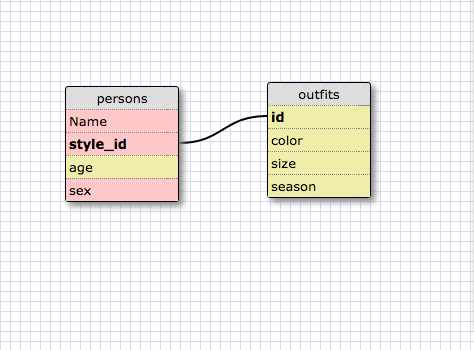

1. select all data for all states
  SELECT * FROM states;

2. select all data for all regions
  SELECT * FROM regions;

3. select state_name and population for all states
  SELECT state_name, population FROM states;

4. select the state_name and population for all states ordered by population. The state with the highest population should be at the top.
  SELECT state_name, population FROM states ORDER BY population DESC;

5. select the state_name for the states in region 7
  SELECT state_name FROM states WHERE region_id = 7;

6. select the state_name and population_density for states with a population density over 50 ordered from least to most dense.
  SELECT state_name, population_density FROM states WHERE population_density > 50 ORDER BY population_density ASC;

7. select the state_name for states with a population between 1 million and 1.5 million people.
  SELECT state_name FROM states WHERE population > 1000000 AND population < 1500000;

8. select the state_name and region_id for states ordered by region ascending order.
  SELECT state_name, region_id FROM states ORDER BY region_id ASC;

9. select the region_name for the regions with "Central" in the name
  SELECT region_name FROM regions WHERE region_name LIKE '%Central%';

10. select the region_name and the state_name for all states and regions in ascending order by region_id. Refer to the region by name.(this will involve joining tables)
  SELECT regions.region_name, states.state_name FROM regions INNER JOIN states ON states.region_id=regions.id ORDER BY regions.id ASC;

REFLECTION What are databases for?

Databases are for efficiently storing information so that it may be
retrieved in a logical and efficient manner. They shift some of the
burden off of the programmer and the program, and reduce dependence on
and the need to write complicated and massive data structures for
storing, retrieving, and relating information.

What is a one-to-many relationship?

A one-to-many relationship is when a primary key of one table
corresponds to many entries in another table. It sounds a little
confusing but is actually somewhat intuitive once learned. For
example, You may have one table that lists an author's name, and an
author_id. Each author has a unique author_id, therefore author_id is
the primary key of the table. You also have another table which is a
list of books by title, book_id, and author_id. For this table the
primary key would be book_id since each book needs a unique ID, the
foreign key would be author_id since this is a column of
another table. This were the one-to-many relationship exists. When a
primary key of when table is repeated many times in another table. An
author can write many books so an author_id may appear many times in
the book table, but only once in the author table. One author to many
books!

What is a primary key? What is a foreign key? How can you determine
which is which?

As I mentioned above, a primary key must be unique for each entry in a
table. A primary is used to uniquely identity an entry and link with
another table if it is used as a foreign key in another table. A table
must have one primary key. A foreign key is column that
references a column of another table. Usually a foreign key will be
the primary key of another table in order to represent a one-to-many
relationship. Its easy to identify a primary vs. a foreign key because
primary keys will be unique for each record, while a foreign key would
likely not be. A foreign key would also probably be found to be the
primary key in another table.

How can you select information out of a SQL database? What are some
general guidelines for that?

Using the SELECT command you can retrieve information. You specify which
columns you would like to display by passing them in parameters to
select. If you would like to display all of the columns you can use
the wild card *. Use the FROM command to specify which table you would
like to select from. Use WHERE to specify the conditions that values
in a column must meet in order to be returned. Use LIKE to pass in a
regex to filter elements. USE JOIN to join tables. you ASC or DSC to
select ascending or descending display order.
