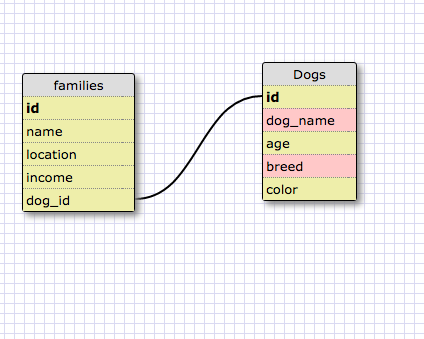
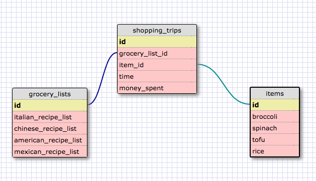

release 2:

This is a one-to-one relationship because each dog in the dogs table can only belong to one family. The dog_id has a one-to-one relationship with id in the dogs table. This is under a basic assumption that each family has only one dog.

release 4:

REFLECTION: What is a one-to-one database?

A one-to-one relationship exists when a row in one table is linked
with one and only one row in another table. There is a one to one
relationship because each entry can only be possessed once by the
other. Like a person and their social security number.

When would you use a one-to-one database? (Think generally, not in
terms of the example you created).

You would use a one-to-one database when you have some data that is
not rarely used and could otherwise be absorbed as a column into the
table it is related to. Creating a one-to-one relationship would be
helpful to link a relationship between these tables.

What is a many-to-many database?

A many to many-to-many relationship exists when an entry in a table
corresponds with many entries in another table, and visa versa. A has
many B and B has many A. This is a very common relationship. Many-to-
many databases are connected by a join table, which keeps track of
their foreign keys.

When would you use a many-to-many database? (Think generally, not in
terms of the example you created).

You would use a many-to-many relationship to model data that involves
a lot of groups. Things like chat-threads and users, gamers and games,
products and customers. You would use the join table to draw out the
relation between the different tables and entries.

What is confusing about database schemas? What makes sense?

Database Schemas are a little confusing to me because it hard for me
to categorize things in the DB way. I am not used to creating tables
based on relationships. I am kind of confused about when, where, and
why to use these the different type of relationships, and how to logic
decide how to choose how to label a table and which information to put
in. I think primary keys and foreign keys make sense. I think its
pretty intuitive that each entry should have a unique key, and that
you can link that information with an entry or entries in another
table with a foreign key.
